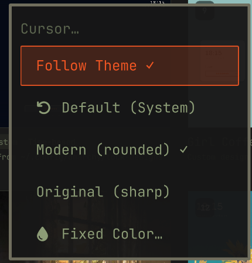

# Cursor Accent

Recolors the system pointer to match the active Omarchy theme's accent
color, automatically, every time you switch themes. No matugen, no new
runtime dependencies: it uses Hyprland's own `hyprcursor-util` (already
installed, since `hyprcursor` is a hard dependency of Hyprland itself) to
compile a [Bibata](https://github.com/ful1e5/Bibata_Cursor) cursor recolored
on the fly from each theme's `colors.toml`.

Also supports locking to one fixed color regardless of theme, turning it off
entirely to use the system default cursor, and choosing between Bibata's
"Modern" (rounded) and "Original" (classic sharp-edged) pointer shapes.

## Install

```sh
omarchy plugin add https://github.com/SmoothPixels/cursor-accent.git --enable
```

Installing the plugin alone does nothing visible yet: it only ships the
mechanism (`recolor.py`) and, while the plugin is enabled, a one-time apply
each time the shell loads it. Following the theme is opt-in, run once
yourself:

```sh
# Follow the active theme automatically from now on, on every `omarchy theme set`
~/.config/omarchy/plugins/io.github.smoothpixels.cursor-accent/tools/install-cursor-hook.sh
```

This generates and installs two hooks through `omarchy hook install`, both
documented Omarchy extension points, and applies the current theme's colors
immediately:

- `theme-set` runs on every `omarchy theme set` and recolors the cursor to
  the new theme.
- `post-boot` runs once per login and re-applies it. `hyprctl setcursor` only
  lasts for the running compositor, and Omarchy sets no `HYPRCURSOR_THEME`,
  so without this hook Hyprland starts with whichever theme directory
  hyprcursor finds first under `~/.local/share/icons`, which is not
  necessarily this one.

The hooks are generated rather than shipped as static files because
`omarchy-hook-install` copies them into `~/.config/omarchy/hooks/<type>.d/`,
not a symlink, so they need this plugin's real install path baked in. If you
set up an earlier version that only installed the `theme-set` hook, re-run
the script once to add the `post-boot` one. Nothing else in this plugin
touches your configuration on its own.

## Settings

There's no settings-form GUI for plugins in Omarchy yet, and unlike
bar-widgets, `service`-kind plugins like this one have no `omarchy bar set`
equivalent at all. Configuration is the bundled `cursor-accent` command, or
the optional menu below:

```sh
~/.config/omarchy/plugins/io.github.smoothpixels.cursor-accent/cursor-accent follow
~/.config/omarchy/plugins/io.github.smoothpixels.cursor-accent/cursor-accent fixed '#39ff14'
~/.config/omarchy/plugins/io.github.smoothpixels.cursor-accent/cursor-accent default
~/.config/omarchy/plugins/io.github.smoothpixels.cursor-accent/cursor-accent shape modern
~/.config/omarchy/plugins/io.github.smoothpixels.cursor-accent/cursor-accent shape original
~/.config/omarchy/plugins/io.github.smoothpixels.cursor-accent/cursor-accent status
```

| Command | Effect |
| --- | --- |
| `follow` | Recolor to the active theme's accent, and keep following it on every theme switch (default). |
| `fixed '#rrggbb'` | Lock to one color, ignoring theme switches. |
| `default` | Turn this off. Reverts to the system's own default cursor (the theme literally named `default`, inherited from Adwaita), and stays off through theme switches until you pick `follow` or `fixed` again. |
| `shape modern\|original` | Bibata's rounded "Modern" shape (default) or the classic sharp-edged "Original". |
| `status` | Print the current mode, shape, and fixed color as JSON. |

Your choice is stored in `~/.local/state/cursor-accent/config.json`, outside
the plugin's own directory, so `omarchy plugin update` never resets it.

## Optional: a real menu picker

There's no settings-form GUI for plugins in Omarchy yet, so if you'd rather
click through a menu than type `cursor-accent` commands, this ships a
ready-made "Style → Cursor" submenu: a checkable row per mode and shape, plus
"Fixed Color..." to prompt for a hex value.



It's opt-in: nothing in this plugin writes to your menu config on its own,
since a plugin silently editing your files on install is exactly what the
marketplace review checklist asks authors *not* to do. Install it yourself:

```sh
~/.config/omarchy/plugins/io.github.smoothpixels.cursor-accent/tools/install-menu-entries.sh
```

This splices `extensions/omarchy-menu.snippet.jsonc` into your own
`~/.config/omarchy/extensions/omarchy-menu.jsonc` (creating it if missing).
The shell watches that file, so it applies within a second or two, no restart
needed. To remove it later, delete the `"style.cursor*"` block from that file
by hand.

## Remove

```sh
rm -f ~/.config/omarchy/hooks/{theme-set,post-boot}.d/cursor-accent.sh
rm -rf ~/.local/share/icons/Omarchy-Accent ~/.local/state/cursor-accent
hyprctl setcursor default 24               # or your preferred size
omarchy plugin remove io.github.smoothpixels.cursor-accent
```

## Development

`src/`, `svg/`, and `config/` are vendored from
[rtgiskard/bibata_cursor](https://github.com/rtgiskard/bibata_cursor) (see
NOTICE.md), pinned to a known-good commit rather than fetched at install
time, so there's no network access at runtime. `recolor.py` patches a
scratch copy of `config/render.json` with the current colors, symlinks the
vendored `src/`/`svg/` into a scratch build directory (to avoid copying
~1.5MB on every theme switch), and runs `cursor_utils.py --hypr` there.

Validate before publishing:

```sh
omarchy plugin validate ~/.config/omarchy/plugins/io.github.smoothpixels.cursor-accent
qmllint -I "$OMARCHY_PATH/shell" ~/.config/omarchy/plugins/io.github.smoothpixels.cursor-accent/Service.qml
```
